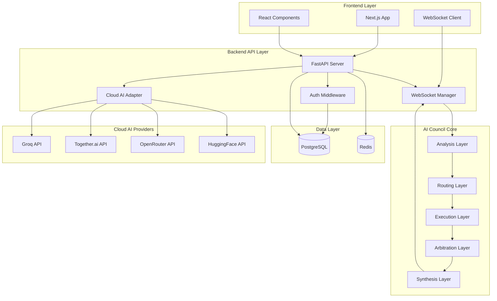
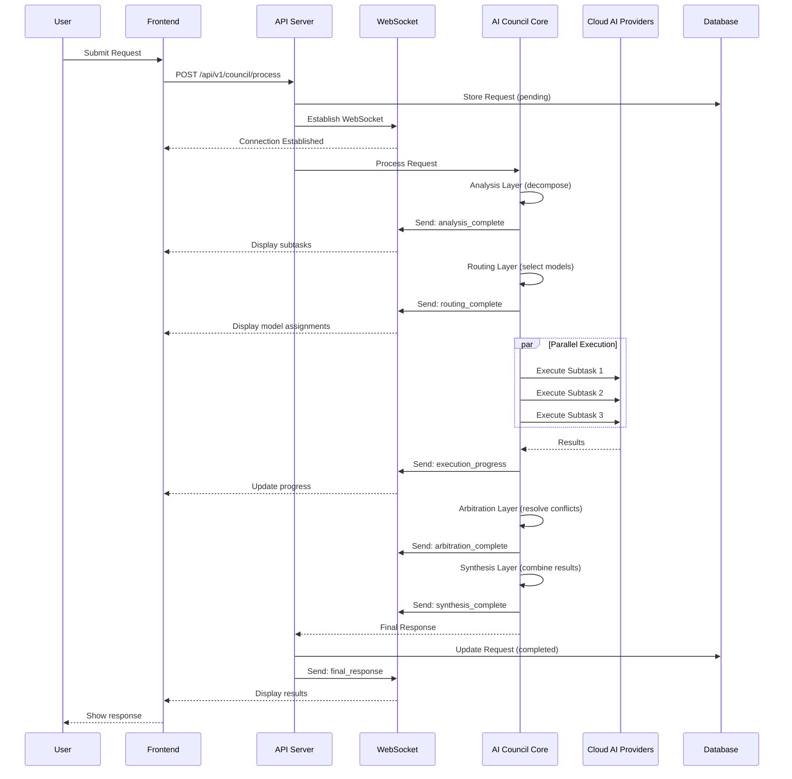

# Design Document: AI Council Web Application

## Overview

This design document specifies the architecture and implementation details for transforming the AI Council Python library into a production-ready multi-user web application. The system follows a three-tier architecture with a React/Next.js frontend, FastAPI backend, and PostgreSQL database, while preserving AI Council's core multi-agent orchestration capabilities.

### System Architecture

The application consists of four primary layers:

1. **Frontend Layer (Next.js + React + Tailwind CSS)**: Provides the user interface for authentication, request submission, real-time progress tracking, and result visualization
2. **Backend API Layer (FastAPI + Python)**: Wraps AI Council Core, manages authentication, handles WebSocket connections, and orchestrates cloud AI provider integrations
3. **AI Council Core Layer (Existing Python Library)**: Performs task analysis, decomposition, routing, execution, arbitration, and synthesis
4. **Data Layer (PostgreSQL + Redis)**: Persists user data, request history, and manages caching and rate limiting

### Key Design Principles

- **Preserve Core Functionality**: Maintain AI Council's existing orchestration logic without modification
- **Cloud-Native**: Replace Ollama with cloud AI providers (Groq, Together.ai, OpenRouter, HuggingFace)
- **Real-Time Communication**: Use WebSockets for live progress updates during multi-agent orchestration
- **Scalability**: Design for horizontal scaling with stateless API servers
- **Security First**: Implement authentication, authorization, rate limiting, and input validation
- **Developer Experience**: Provide comprehensive API documentation and SDKs

## Architecture

### High-Level Architecture Diagram




### Request Processing Flow



### Technology Stack

**Frontend:**
- Next.js 14 (App Router)
- React 18
- TypeScript
- Tailwind CSS
- shadcn/ui components
- WebSocket client (native WebSocket API)
- React Query for data fetching
- Zustand for state management

**Backend:**
- Python 3.11+
- FastAPI 0.104+
- Pydantic v2 for validation
- SQLAlchemy 2.0 for ORM
- Alembic for migrations
- python-jose for JWT
- passlib with bcrypt for password hashing
- websockets for real-time communication
- httpx for async HTTP requests
- Redis for caching and rate limiting

**Database:**
- PostgreSQL 15+ (primary database)
- Redis 7+ (caching, rate limiting, session management)

**Cloud AI Providers:**
- Groq (Llama 3, Mixtral) - ultra-fast inference
- Together.ai (Mixtral, Llama 2) - diverse model selection
- OpenRouter (multi-provider access) - fallback and variety
- HuggingFace Inference API (open models) - cost-effective option

**Deployment:**
- Frontend: Vercel (automatic deployments, edge functions)
- Backend: Railway.app or Render.com (container deployment)
- Database: Railway PostgreSQL or Supabase
- Redis: Upstash (serverless Redis)
- Domain: Custom domain with SSL via Vercel/Railway


## Components and Interfaces

### Frontend Components

#### 1. Authentication Components

**LoginForm Component**
```typescript
interface LoginFormProps {
  onSuccess: (token: string) => void;
  onError: (error: string) => void;
}

// Handles user login with email/password
// Validates input, calls /api/v1/auth/login
// Stores JWT token in localStorage and httpOnly cookie
```

**RegisterForm Component**
```typescript
interface RegisterFormProps {
  onSuccess: (token: string) => void;
  onError: (error: string) => void;
}

// Handles user registration
// Validates email format, password strength
// Calls /api/v1/auth/register
```

#### 2. Request Submission Components

**QueryInput Component**
```typescript
interface QueryInputProps {
  onSubmit: (query: string, mode: ExecutionMode) => void;
  maxLength: number;
  showCostEstimate: boolean;
}

// Multi-line text input for user queries
// Real-time character count
// Execution mode selector (FAST, BALANCED, BEST_QUALITY)
// Cost estimation display
```

**ExecutionModeSelector Component**
```typescript
interface ExecutionMode {
  value: 'fast' | 'balanced' | 'best_quality';
  label: string;
  description: string;
  estimatedCost: number;
  estimatedTime: number;
}

// Radio button group for execution mode selection
// Shows cost/time estimates for each mode
// Highlights recommended mode based on query complexity
```

#### 3. Real-Time Progress Components

**OrchestrationVisualization Component**
```typescript
interface OrchestrationState {
  stage: 'analysis' | 'routing' | 'execution' | 'arbitration' | 'synthesis' | 'complete';
  subtasks: Subtask[];
  activeExecutions: ExecutionProgress[];
  completedSubtasks: number;
  totalSubtasks: number;
}

// Visual diagram showing orchestration flow
// Animated transitions between stages
// Real-time updates via WebSocket
// Shows parallel execution with multiple agent cards
```

**ProgressTimeline Component**
```typescript
interface TimelineEvent {
  timestamp: Date;
  stage: string;
  message: string;
  metadata?: Record<string, any>;
}

// Chronological list of orchestration events
// Auto-scrolls to latest event
// Expandable details for each event
```

#### 4. Response Display Components

**ResponseViewer Component**
```typescript
interface CouncilResponse {
  content: string;
  confidence: number;
  executionTime: number;
  totalCost: number;
  modelsUsed: ModelContribution[];
  subtaskResults: SubtaskResult[];
  arbitrationDecisions?: ArbitrationDecision[];
}

// Displays final synthesized response
// Syntax highlighting for code blocks
// Copy to clipboard functionality
// Download as JSON option
```

**OrchestrationBreakdown Component**
```typescript
interface OrchestrationBreakdown {
  decompositionTree: TaskNode[];
  modelContributions: ModelContribution[];
  costBreakdown: CostByModel[];
  parallelEfficiency: number;
}

// Expandable tree view of task decomposition
// Table showing which models handled which subtasks
// Cost breakdown by model and subtask
// Parallel execution efficiency metrics
```


#### 5. History and Dashboard Components

**RequestHistoryList Component**
```typescript
interface HistoryItem {
  id: string;
  content: string;
  executionMode: string;
  status: 'pending' | 'completed' | 'failed';
  createdAt: Date;
  cost?: number;
  confidence?: number;
}

// Paginated list of user's past requests
// Search and filter functionality
// Click to view full details
```

**UserDashboard Component**
```typescript
interface DashboardStats {
  totalRequests: number;
  totalCost: number;
  averageConfidence: number;
  requestsByMode: Record<string, number>;
  requestsOverTime: TimeSeriesData[];
  topModels: ModelUsage[];
}

// Overview cards with key metrics
// Charts for requests over time
// Model usage breakdown
// Cost trends
```

### Backend API Endpoints

#### Authentication Endpoints

```python
POST /api/v1/auth/register
Request:
{
  "email": "user@example.com",
  "password": "securepass123",
  "name": "John Doe"
}
Response:
{
  "token": "eyJhbGc...",
  "user": {
    "id": "uuid",
    "email": "user@example.com",
    "name": "John Doe",
    "role": "user"
  }
}

POST /api/v1/auth/login
Request:
{
  "email": "user@example.com",
  "password": "securepass123"
}
Response:
{
  "token": "eyJhbGc...",
  "user": {...}
}

POST /api/v1/auth/logout
Headers: Authorization: Bearer <token>
Response: 204 No Content

GET /api/v1/auth/me
Headers: Authorization: Bearer <token>
Response:
{
  "id": "uuid",
  "email": "user@example.com",
  "name": "John Doe",
  "role": "user",
  "createdAt": "2024-01-01T00:00:00Z"
}
```

#### Council Processing Endpoints

```python
POST /api/v1/council/process
Headers: Authorization: Bearer <token>
Request:
{
  "content": "Analyze the pros and cons of renewable energy...",
  "executionMode": "balanced"
}
Response:
{
  "requestId": "uuid",
  "status": "pending",
  "websocketUrl": "wss://api.example.com/ws/uuid"
}

GET /api/v1/council/status/{requestId}
Headers: Authorization: Bearer <token>
Response:
{
  "requestId": "uuid",
  "status": "completed",
  "progress": 100,
  "currentStage": "synthesis"
}

GET /api/v1/council/result/{requestId}
Headers: Authorization: Bearer <token>
Response:
{
  "requestId": "uuid",
  "content": "Final synthesized response...",
  "confidence": 0.92,
  "executionTime": 12.5,
  "totalCost": 0.0234,
  "modelsUsed": [...],
  "orchestrationMetadata": {...}
}
```

#### History and Statistics Endpoints

```python
GET /api/v1/council/history
Headers: Authorization: Bearer <token>
Query Params: page=1, limit=20, search="", mode="", startDate="", endDate=""
Response:
{
  "items": [...],
  "total": 150,
  "page": 1,
  "pages": 8
}

GET /api/v1/user/stats
Headers: Authorization: Bearer <token>
Response:
{
  "totalRequests": 150,
  "totalCost": 2.45,
  "averageConfidence": 0.87,
  "requestsByMode": {...},
  "requestsOverTime": [...],
  "topModels": [...]
}
```


#### Admin Endpoints

```python
GET /api/v1/admin/users
Headers: Authorization: Bearer <admin-token>
Query Params: page=1, limit=50
Response:
{
  "users": [
    {
      "id": "uuid",
      "email": "user@example.com",
      "name": "John Doe",
      "role": "user",
      "isActive": true,
      "totalRequests": 45,
      "createdAt": "2024-01-01T00:00:00Z"
    }
  ],
  "total": 250,
  "page": 1,
  "pages": 5
}

PATCH /api/v1/admin/users/{userId}
Headers: Authorization: Bearer <admin-token>
Request:
{
  "isActive": false,
  "role": "admin"
}
Response: 200 OK

GET /api/v1/admin/monitoring
Headers: Authorization: Bearer <admin-token>
Response:
{
  "totalUsers": 250,
  "requestsLast24h": 1250,
  "averageResponseTime": 8.5,
  "totalCostLast24h": 45.67,
  "successRate": 0.98,
  "activeWebsockets": 12,
  "providerHealth": {
    "groq": "healthy",
    "together": "healthy",
    "openrouter": "degraded",
    "huggingface": "healthy"
  },
  "circuitBreakers": {
    "groq": "closed",
    "together": "closed",
    "openrouter": "open",
    "huggingface": "closed"
  }
}
```

### WebSocket Protocol

#### Connection Establishment

```typescript
// Client connects with authentication
const ws = new WebSocket(`wss://api.example.com/ws/${requestId}?token=${authToken}`);

// Server validates token and associates connection with request
```

#### Message Types

```typescript
// Analysis Started
{
  "type": "analysis_started",
  "timestamp": "2024-01-01T12:00:00Z",
  "data": {
    "intent": "analysis",
    "complexity": "complex"
  }
}

// Task Decomposition Complete
{
  "type": "decomposition_complete",
  "timestamp": "2024-01-01T12:00:02Z",
  "data": {
    "subtasks": [
      {
        "id": "subtask-1",
        "content": "Research renewable energy benefits",
        "taskType": "research",
        "priority": "high"
      },
      {
        "id": "subtask-2",
        "content": "Analyze cost implications",
        "taskType": "reasoning",
        "priority": "high"
      }
    ]
  }
}

// Routing Complete
{
  "type": "routing_complete",
  "timestamp": "2024-01-01T12:00:03Z",
  "data": {
    "assignments": [
      {
        "subtaskId": "subtask-1",
        "modelId": "groq-llama3-70b",
        "reason": "Best for research tasks"
      },
      {
        "subtaskId": "subtask-2",
        "modelId": "together-mixtral-8x7b",
        "reason": "Strong reasoning capabilities"
      }
    ]
  }
}

// Execution Progress
{
  "type": "execution_progress",
  "timestamp": "2024-01-01T12:00:05Z",
  "data": {
    "subtaskId": "subtask-1",
    "status": "completed",
    "confidence": 0.89,
    "cost": 0.0012,
    "executionTime": 2.1
  }
}

// Arbitration Decision
{
  "type": "arbitration_decision",
  "timestamp": "2024-01-01T12:00:10Z",
  "data": {
    "subtaskId": "subtask-3",
    "conflictingResults": 2,
    "selectedResult": "result-a",
    "reason": "Higher confidence and better evidence"
  }
}

// Synthesis Progress
{
  "type": "synthesis_progress",
  "timestamp": "2024-01-01T12:00:12Z",
  "data": {
    "stage": "combining_results",
    "progress": 75
  }
}

// Final Response
{
  "type": "final_response",
  "timestamp": "2024-01-01T12:00:15Z",
  "data": {
    "content": "Final synthesized response...",
    "confidence": 0.92,
    "executionTime": 15.0,
    "totalCost": 0.0234,
    "modelsUsed": ["groq-llama3-70b", "together-mixtral-8x7b"],
    "orchestrationMetadata": {...}
  }
}

// Error
{
  "type": "error",
  "timestamp": "2024-01-01T12:00:05Z",
  "data": {
    "message": "Model execution failed",
    "code": "MODEL_ERROR",
    "retrying": true
  }
}
```


### Cloud AI Provider Adapter

The Cloud AI Provider Adapter implements the `AIModel` interface from AI Council Core and translates requests to cloud provider APIs.

```python
class CloudAIAdapter(AIModel):
    """Adapter for cloud AI providers that implements AIModel interface."""
    
    def __init__(self, provider: str, model_id: str, api_key: str):
        self.provider = provider  # 'groq', 'together', 'openrouter', 'huggingface'
        self.model_id = model_id
        self.api_key = api_key
        self.client = self._create_client()
    
    def generate_response(self, prompt: str, **kwargs) -> str:
        """Generate response from cloud AI provider."""
        # Translate to provider-specific API format
        # Handle rate limiting and retries
        # Parse response back to string
        pass
    
    def get_model_id(self) -> str:
        return f"{self.provider}-{self.model_id}"
    
    def _create_client(self):
        """Create provider-specific HTTP client."""
        if self.provider == 'groq':
            return GroqClient(api_key=self.api_key)
        elif self.provider == 'together':
            return TogetherClient(api_key=self.api_key)
        elif self.provider == 'openrouter':
            return OpenRouterClient(api_key=self.api_key)
        elif self.provider == 'huggingface':
            return HuggingFaceClient(api_key=self.api_key)
```

#### Provider-Specific Implementations

**Groq Client**
```python
class GroqClient:
    """Client for Groq API (ultra-fast inference)."""
    
    BASE_URL = "https://api.groq.com/openai/v1"
    
    async def chat_completion(self, messages: List[Dict], model: str, **kwargs) -> str:
        """Call Groq chat completion API."""
        async with httpx.AsyncClient() as client:
            response = await client.post(
                f"{self.BASE_URL}/chat/completions",
                headers={"Authorization": f"Bearer {self.api_key}"},
                json={
                    "model": model,  # e.g., "llama3-70b-8192"
                    "messages": messages,
                    "temperature": kwargs.get("temperature", 0.7),
                    "max_tokens": kwargs.get("max_tokens", 1000)
                }
            )
            data = response.json()
            return data["choices"][0]["message"]["content"]
```

**Together.ai Client**
```python
class TogetherClient:
    """Client for Together.ai API."""
    
    BASE_URL = "https://api.together.xyz/v1"
    
    async def inference(self, prompt: str, model: str, **kwargs) -> str:
        """Call Together.ai inference API."""
        async with httpx.AsyncClient() as client:
            response = await client.post(
                f"{self.BASE_URL}/inference",
                headers={"Authorization": f"Bearer {self.api_key}"},
                json={
                    "model": model,  # e.g., "mistralai/Mixtral-8x7B-Instruct-v0.1"
                    "prompt": prompt,
                    "temperature": kwargs.get("temperature", 0.7),
                    "max_tokens": kwargs.get("max_tokens", 1000)
                }
            )
            data = response.json()
            return data["output"]["choices"][0]["text"]
```

**OpenRouter Client**
```python
class OpenRouterClient:
    """Client for OpenRouter API (multi-provider access)."""
    
    BASE_URL = "https://openrouter.ai/api/v1"
    
    async def chat_completion(self, messages: List[Dict], model: str, **kwargs) -> str:
        """Call OpenRouter chat completion API."""
        async with httpx.AsyncClient() as client:
            response = await client.post(
                f"{self.BASE_URL}/chat/completions",
                headers={
                    "Authorization": f"Bearer {self.api_key}",
                    "HTTP-Referer": "https://aicouncil.app",
                    "X-Title": "AI Council"
                },
                json={
                    "model": model,  # e.g., "anthropic/claude-3-sonnet"
                    "messages": messages,
                    "temperature": kwargs.get("temperature", 0.7),
                    "max_tokens": kwargs.get("max_tokens", 1000)
                }
            )
            data = response.json()
            return data["choices"][0]["message"]["content"]
```

**HuggingFace Client**
```python
class HuggingFaceClient:
    """Client for HuggingFace Inference API."""
    
    BASE_URL = "https://api-inference.huggingface.co/models"
    
    async def text_generation(self, prompt: str, model: str, **kwargs) -> str:
        """Call HuggingFace text generation API."""
        async with httpx.AsyncClient() as client:
            response = await client.post(
                f"{self.BASE_URL}/{model}",
                headers={"Authorization": f"Bearer {self.api_key}"},
                json={
                    "inputs": prompt,
                    "parameters": {
                        "temperature": kwargs.get("temperature", 0.7),
                        "max_new_tokens": kwargs.get("max_tokens", 1000)
                    }
                }
            )
            data = response.json()
            return data[0]["generated_text"]
```


### Model Registry Configuration

The system maintains a registry of available cloud AI models with their capabilities and cost profiles.

```python
MODEL_REGISTRY = {
    "groq-llama3-70b": {
        "provider": "groq",
        "model_name": "llama3-70b-8192",
        "capabilities": [TaskType.REASONING, TaskType.RESEARCH, TaskType.CODE_GENERATION],
        "cost_per_input_token": 0.00000059,
        "cost_per_output_token": 0.00000079,
        "average_latency": 0.5,  # seconds
        "max_context": 8192,
        "reliability_score": 0.95
    },
    "groq-mixtral-8x7b": {
        "provider": "groq",
        "model_name": "mixtral-8x7b-32768",
        "capabilities": [TaskType.REASONING, TaskType.CREATIVE_OUTPUT],
        "cost_per_input_token": 0.00000027,
        "cost_per_output_token": 0.00000027,
        "average_latency": 0.4,
        "max_context": 32768,
        "reliability_score": 0.93
    },
    "together-mixtral-8x7b": {
        "provider": "together",
        "model_name": "mistralai/Mixtral-8x7B-Instruct-v0.1",
        "capabilities": [TaskType.REASONING, TaskType.CODE_GENERATION],
        "cost_per_input_token": 0.0000006,
        "cost_per_output_token": 0.0000006,
        "average_latency": 1.2,
        "max_context": 32768,
        "reliability_score": 0.92
    },
    "together-llama2-70b": {
        "provider": "together",
        "model_name": "meta-llama/Llama-2-70b-chat-hf",
        "capabilities": [TaskType.RESEARCH, TaskType.CREATIVE_OUTPUT],
        "cost_per_input_token": 0.0000009,
        "cost_per_output_token": 0.0000009,
        "average_latency": 1.5,
        "max_context": 4096,
        "reliability_score": 0.90
    },
    "openrouter-claude-3-sonnet": {
        "provider": "openrouter",
        "model_name": "anthropic/claude-3-sonnet",
        "capabilities": [TaskType.REASONING, TaskType.RESEARCH, TaskType.CODE_GENERATION, TaskType.FACT_CHECKING],
        "cost_per_input_token": 0.000003,
        "cost_per_output_token": 0.000015,
        "average_latency": 2.0,
        "max_context": 200000,
        "reliability_score": 0.98
    },
    "openrouter-gpt4-turbo": {
        "provider": "openrouter",
        "model_name": "openai/gpt-4-turbo",
        "capabilities": [TaskType.REASONING, TaskType.CODE_GENERATION, TaskType.DEBUGGING],
        "cost_per_input_token": 0.00001,
        "cost_per_output_token": 0.00003,
        "average_latency": 3.0,
        "max_context": 128000,
        "reliability_score": 0.97
    },
    "huggingface-mistral-7b": {
        "provider": "huggingface",
        "model_name": "mistralai/Mistral-7B-Instruct-v0.2",
        "capabilities": [TaskType.REASONING, TaskType.CREATIVE_OUTPUT],
        "cost_per_input_token": 0.0000002,
        "cost_per_output_token": 0.0000002,
        "average_latency": 2.5,
        "max_context": 32768,
        "reliability_score": 0.85
    }
}
```

### WebSocket Manager

The WebSocket Manager handles real-time communication between the backend and frontend during request processing.

```python
class WebSocketManager:
    """Manages WebSocket connections for real-time updates."""
    
    def __init__(self):
        self.active_connections: Dict[str, WebSocket] = {}
        self.connection_metadata: Dict[str, Dict] = {}
    
    async def connect(self, request_id: str, websocket: WebSocket, user_id: str):
        """Accept and register a new WebSocket connection."""
        await websocket.accept()
        self.active_connections[request_id] = websocket
        self.connection_metadata[request_id] = {
            "user_id": user_id,
            "connected_at": datetime.utcnow(),
            "last_heartbeat": datetime.utcnow()
        }
    
    async def disconnect(self, request_id: str):
        """Remove a WebSocket connection."""
        if request_id in self.active_connections:
            del self.active_connections[request_id]
            del self.connection_metadata[request_id]
    
    async def send_message(self, request_id: str, message: Dict):
        """Send a message to a specific connection."""
        if request_id in self.active_connections:
            websocket = self.active_connections[request_id]
            try:
                await websocket.send_json(message)
            except Exception as e:
                logger.error(f"Failed to send message: {e}")
                await self.disconnect(request_id)
    
    async def broadcast_progress(self, request_id: str, event_type: str, data: Dict):
        """Broadcast orchestration progress to connected client."""
        message = {
            "type": event_type,
            "timestamp": datetime.utcnow().isoformat(),
            "data": data
        }
        await self.send_message(request_id, message)
    
    async def heartbeat_loop(self):
        """Send periodic heartbeat messages to keep connections alive."""
        while True:
            await asyncio.sleep(30)
            for request_id, websocket in list(self.active_connections.items()):
                try:
                    await websocket.send_json({"type": "heartbeat"})
                    self.connection_metadata[request_id]["last_heartbeat"] = datetime.utcnow()
                except:
                    await self.disconnect(request_id)
```


### AI Council Integration Layer

This layer bridges the FastAPI backend with AI Council Core, hooking into orchestration events to send WebSocket updates.

```python
class CouncilOrchestrationBridge:
    """Bridges AI Council Core with WebSocket updates."""
    
    def __init__(self, websocket_manager: WebSocketManager):
        self.ws_manager = websocket_manager
        self.ai_council = None
    
    async def process_request(
        self, 
        request_id: str, 
        user_input: str, 
        execution_mode: ExecutionMode
    ) -> FinalResponse:
        """Process request through AI Council with real-time updates."""
        
        # Initialize AI Council with cloud AI adapters
        self.ai_council = self._create_ai_council()
        
        # Hook into orchestration events
        self._setup_event_hooks(request_id)
        
        # Process request
        response = await asyncio.to_thread(
            self.ai_council.process_request,
            user_input,
            execution_mode
        )
        
        return response
    
    def _create_ai_council(self):
        """Create AI Council instance with cloud AI adapters."""
        factory = AICouncilFactory()
        
        # Replace mock models with cloud AI adapters
        cloud_models = []
        for model_id, config in MODEL_REGISTRY.items():
            adapter = CloudAIAdapter(
                provider=config["provider"],
                model_id=config["model_name"],
                api_key=get_api_key(config["provider"])
            )
            cloud_models.append(adapter)
        
        # Register models with AI Council
        for model in cloud_models:
            factory.model_registry.register_model(model)
        
        return factory.create_ai_council_sync()
    
    def _setup_event_hooks(self, request_id: str):
        """Set up hooks to capture orchestration events."""
        
        # Hook into analysis layer
        original_analyze = self.ai_council.orchestration_layer.analysis_layer.analyze
        async def hooked_analyze(task):
            result = original_analyze(task)
            await self.ws_manager.broadcast_progress(
                request_id,
                "analysis_complete",
                {
                    "intent": result.intent.value if result.intent else None,
                    "complexity": result.complexity.value if result.complexity else None
                }
            )
            return result
        self.ai_council.orchestration_layer.analysis_layer.analyze = hooked_analyze
        
        # Hook into routing layer
        original_route = self.ai_council.orchestration_layer.routing_layer.route_subtasks
        async def hooked_route(subtasks):
            assignments = original_route(subtasks)
            await self.ws_manager.broadcast_progress(
                request_id,
                "routing_complete",
                {
                    "assignments": [
                        {
                            "subtaskId": st.id,
                            "modelId": model.get_model_id(),
                            "reason": "Selected based on capabilities"
                        }
                        for st, model in assignments
                    ]
                }
            )
            return assignments
        self.ai_council.orchestration_layer.routing_layer.route_subtasks = hooked_route
        
        # Hook into execution layer
        original_execute = self.ai_council.orchestration_layer.execution_layer.execute
        async def hooked_execute(subtask, model):
            result = original_execute(subtask, model)
            await self.ws_manager.broadcast_progress(
                request_id,
                "execution_progress",
                {
                    "subtaskId": subtask.id,
                    "status": "completed" if result.success else "failed",
                    "confidence": result.self_assessment.confidence_score if result.self_assessment else 0,
                    "cost": result.self_assessment.estimated_cost if result.self_assessment else 0,
                    "executionTime": result.self_assessment.execution_time if result.self_assessment else 0
                }
            )
            return result
        self.ai_council.orchestration_layer.execution_layer.execute = hooked_execute
```

## Data Models

### Database Schema

#### Users Table

```sql
CREATE TABLE users (
    id UUID PRIMARY KEY DEFAULT gen_random_uuid(),
    email VARCHAR(255) UNIQUE NOT NULL,
    password_hash VARCHAR(255) NOT NULL,
    name VARCHAR(255) NOT NULL,
    role VARCHAR(50) NOT NULL DEFAULT 'user',
    is_active BOOLEAN NOT NULL DEFAULT true,
    created_at TIMESTAMP NOT NULL DEFAULT NOW(),
    updated_at TIMESTAMP NOT NULL DEFAULT NOW()
);

CREATE INDEX idx_users_email ON users(email);
CREATE INDEX idx_users_role ON users(role);
CREATE INDEX idx_users_created_at ON users(created_at);
```

#### Requests Table

```sql
CREATE TABLE requests (
    id UUID PRIMARY KEY DEFAULT gen_random_uuid(),
    user_id UUID NOT NULL REFERENCES users(id) ON DELETE CASCADE,
    content TEXT NOT NULL,
    execution_mode VARCHAR(50) NOT NULL,
    status VARCHAR(50) NOT NULL DEFAULT 'pending',
    created_at TIMESTAMP NOT NULL DEFAULT NOW(),
    completed_at TIMESTAMP,
    CONSTRAINT fk_user FOREIGN KEY (user_id) REFERENCES users(id)
);

CREATE INDEX idx_requests_user_id ON requests(user_id);
CREATE INDEX idx_requests_status ON requests(status);
CREATE INDEX idx_requests_created_at ON requests(created_at);
CREATE INDEX idx_requests_user_created ON requests(user_id, created_at DESC);
```

#### Responses Table

```sql
CREATE TABLE responses (
    id UUID PRIMARY KEY DEFAULT gen_random_uuid(),
    request_id UUID NOT NULL REFERENCES requests(id) ON DELETE CASCADE,
    content TEXT NOT NULL,
    confidence DECIMAL(5, 4) NOT NULL,
    total_cost DECIMAL(10, 6) NOT NULL,
    execution_time DECIMAL(10, 2) NOT NULL,
    models_used JSONB NOT NULL,
    orchestration_metadata JSONB NOT NULL,
    created_at TIMESTAMP NOT NULL DEFAULT NOW(),
    CONSTRAINT fk_request FOREIGN KEY (request_id) REFERENCES requests(id)
);

CREATE INDEX idx_responses_request_id ON responses(request_id);
CREATE INDEX idx_responses_created_at ON responses(created_at);
```


#### Subtasks Table (for detailed orchestration tracking)

```sql
CREATE TABLE subtasks (
    id UUID PRIMARY KEY DEFAULT gen_random_uuid(),
    request_id UUID NOT NULL REFERENCES requests(id) ON DELETE CASCADE,
    content TEXT NOT NULL,
    task_type VARCHAR(50) NOT NULL,
    priority VARCHAR(50) NOT NULL,
    assigned_model VARCHAR(255) NOT NULL,
    status VARCHAR(50) NOT NULL DEFAULT 'pending',
    result TEXT,
    confidence DECIMAL(5, 4),
    cost DECIMAL(10, 6),
    execution_time DECIMAL(10, 2),
    created_at TIMESTAMP NOT NULL DEFAULT NOW(),
    completed_at TIMESTAMP,
    CONSTRAINT fk_request FOREIGN KEY (request_id) REFERENCES requests(id)
);

CREATE INDEX idx_subtasks_request_id ON subtasks(request_id);
CREATE INDEX idx_subtasks_status ON subtasks(status);
```

### SQLAlchemy Models

```python
from sqlalchemy import Column, String, Boolean, DateTime, Text, Numeric, ForeignKey
from sqlalchemy.dialects.postgresql import UUID, JSONB
from sqlalchemy.orm import relationship
from datetime import datetime
import uuid

class User(Base):
    __tablename__ = "users"
    
    id = Column(UUID(as_uuid=True), primary_key=True, default=uuid.uuid4)
    email = Column(String(255), unique=True, nullable=False, index=True)
    password_hash = Column(String(255), nullable=False)
    name = Column(String(255), nullable=False)
    role = Column(String(50), nullable=False, default="user", index=True)
    is_active = Column(Boolean, nullable=False, default=True)
    created_at = Column(DateTime, nullable=False, default=datetime.utcnow, index=True)
    updated_at = Column(DateTime, nullable=False, default=datetime.utcnow, onupdate=datetime.utcnow)
    
    # Relationships
    requests = relationship("Request", back_populates="user", cascade="all, delete-orphan")

class Request(Base):
    __tablename__ = "requests"
    
    id = Column(UUID(as_uuid=True), primary_key=True, default=uuid.uuid4)
    user_id = Column(UUID(as_uuid=True), ForeignKey("users.id"), nullable=False, index=True)
    content = Column(Text, nullable=False)
    execution_mode = Column(String(50), nullable=False)
    status = Column(String(50), nullable=False, default="pending", index=True)
    created_at = Column(DateTime, nullable=False, default=datetime.utcnow, index=True)
    completed_at = Column(DateTime)
    
    # Relationships
    user = relationship("User", back_populates="requests")
    response = relationship("Response", back_populates="request", uselist=False, cascade="all, delete-orphan")
    subtasks = relationship("Subtask", back_populates="request", cascade="all, delete-orphan")

class Response(Base):
    __tablename__ = "responses"
    
    id = Column(UUID(as_uuid=True), primary_key=True, default=uuid.uuid4)
    request_id = Column(UUID(as_uuid=True), ForeignKey("requests.id"), nullable=False, index=True)
    content = Column(Text, nullable=False)
    confidence = Column(Numeric(5, 4), nullable=False)
    total_cost = Column(Numeric(10, 6), nullable=False)
    execution_time = Column(Numeric(10, 2), nullable=False)
    models_used = Column(JSONB, nullable=False)
    orchestration_metadata = Column(JSONB, nullable=False)
    created_at = Column(DateTime, nullable=False, default=datetime.utcnow, index=True)
    
    # Relationships
    request = relationship("Request", back_populates="response")

class Subtask(Base):
    __tablename__ = "subtasks"
    
    id = Column(UUID(as_uuid=True), primary_key=True, default=uuid.uuid4)
    request_id = Column(UUID(as_uuid=True), ForeignKey("requests.id"), nullable=False, index=True)
    content = Column(Text, nullable=False)
    task_type = Column(String(50), nullable=False)
    priority = Column(String(50), nullable=False)
    assigned_model = Column(String(255), nullable=False)
    status = Column(String(50), nullable=False, default="pending", index=True)
    result = Column(Text)
    confidence = Column(Numeric(5, 4))
    cost = Column(Numeric(10, 6))
    execution_time = Column(Numeric(10, 2))
    created_at = Column(DateTime, nullable=False, default=datetime.utcnow)
    completed_at = Column(DateTime)
    
    # Relationships
    request = relationship("Request", back_populates="subtasks")
```

### Pydantic Schemas (API Request/Response Models)

```python
from pydantic import BaseModel, EmailStr, Field, validator
from typing import Optional, List, Dict, Any
from datetime import datetime
from enum import Enum

class ExecutionModeEnum(str, Enum):
    FAST = "fast"
    BALANCED = "balanced"
    BEST_QUALITY = "best_quality"

class UserRole(str, Enum):
    USER = "user"
    ADMIN = "admin"

# Authentication Schemas
class UserRegister(BaseModel):
    email: EmailStr
    password: str = Field(..., min_length=8)
    name: str = Field(..., min_length=1, max_length=255)
    
    @validator('password')
    def validate_password(cls, v):
        if not any(c.isupper() for c in v):
            raise ValueError('Password must contain at least one uppercase letter')
        if not any(c.isdigit() for c in v):
            raise ValueError('Password must contain at least one digit')
        return v

class UserLogin(BaseModel):
    email: EmailStr
    password: str

class UserResponse(BaseModel):
    id: str
    email: str
    name: str
    role: UserRole
    created_at: datetime
    
    class Config:
        from_attributes = True

class TokenResponse(BaseModel):
    token: str
    user: UserResponse

# Request Schemas
class CouncilRequestCreate(BaseModel):
    content: str = Field(..., min_length=1, max_length=5000)
    execution_mode: ExecutionModeEnum = ExecutionModeEnum.BALANCED

class CouncilRequestResponse(BaseModel):
    request_id: str
    status: str
    websocket_url: str

class SubtaskInfo(BaseModel):
    id: str
    content: str
    task_type: str
    priority: str
    assigned_model: Optional[str] = None
    status: str
    confidence: Optional[float] = None
    cost: Optional[float] = None
    execution_time: Optional[float] = None

class ModelContribution(BaseModel):
    model_id: str
    subtasks_handled: List[str]
    total_cost: float
    average_confidence: float

class OrchestrationMetadata(BaseModel):
    decomposition_tree: Dict[str, Any]
    parallel_executions: int
    arbitration_decisions: List[Dict[str, Any]]
    synthesis_notes: List[str]

class CouncilResponseDetail(BaseModel):
    request_id: str
    content: str
    confidence: float
    execution_time: float
    total_cost: float
    models_used: List[str]
    model_contributions: List[ModelContribution]
    subtasks: List[SubtaskInfo]
    orchestration_metadata: OrchestrationMetadata
    created_at: datetime

# History Schemas
class RequestHistoryItem(BaseModel):
    id: str
    content: str
    execution_mode: str
    status: str
    created_at: datetime
    completed_at: Optional[datetime] = None
    confidence: Optional[float] = None
    cost: Optional[float] = None
    
    class Config:
        from_attributes = True

class RequestHistoryResponse(BaseModel):
    items: List[RequestHistoryItem]
    total: int
    page: int
    pages: int

# Statistics Schemas
class UserStats(BaseModel):
    total_requests: int
    total_cost: float
    average_confidence: float
    requests_by_mode: Dict[str, int]
    requests_over_time: List[Dict[str, Any]]
    top_models: List[Dict[str, Any]]
    average_response_time: float
```


### Redis Data Structures

```python
# Rate Limiting Keys
rate_limit:{user_id}:hour:{timestamp} -> counter (expires in 1 hour)
rate_limit:demo:{ip_address}:hour:{timestamp} -> counter (expires in 1 hour)

# WebSocket Session Tracking
websocket:active:{request_id} -> {user_id, connected_at, last_heartbeat}

# Request Status Cache
request:status:{request_id} -> {status, progress, current_stage} (expires in 24 hours)

# Cost Estimation Cache
cost:estimate:{request_hash} -> {fast_cost, balanced_cost, best_quality_cost} (expires in 1 hour)
```

## Correctness Properties

*A property is a characteristic or behavior that should hold true across all valid executions of a system—essentially, a formal statement about what the system should do. Properties serve as the bridge between human-readable specifications and machine-verifiable correctness guarantees.*

### Cloud AI Integration Properties

**Property 1: Cloud AI Provider Response Parsing**
*For any* valid response from a Cloud_AI_Provider (Groq, Together.ai, OpenRouter, HuggingFace), parsing it into AgentResponse format should produce a valid AgentResponse with all required fields populated
**Validates: Requirements 1.3**

**Property 2: Model Routing Based on Capabilities**
*For any* subtask with a specific task type, the routing system should select a Cloud_AI_Provider whose capabilities include that task type
**Validates: Requirements 1.2, 4.5**

**Property 3: Cost Calculation Accuracy**
*For any* completed request with known token counts, the calculated cost should match the sum of (input_tokens × cost_per_input_token + output_tokens × cost_per_output_token) for each model used
**Validates: Requirements 1.6**

**Property 4: Circuit Breaker Activation on Failures**
*For any* Cloud_AI_Provider that fails repeatedly (5+ times), the circuit breaker should open and prevent further requests to that provider
**Validates: Requirements 1.4**

### Authentication and Security Properties

**Property 5: Password Hashing with Bcrypt**
*For any* user registration with a password, the stored password_hash should be a valid bcrypt hash with cost factor 12, and should not equal the plaintext password
**Validates: Requirements 2.6, 17.1**

**Property 6: Valid Registration Creates User**
*For any* valid registration data (unique email, password ≥8 chars, non-empty name), submitting it should create a new User record in the database
**Validates: Requirements 2.1**

**Property 7: JWT Token Validity Period**
*For any* successful login, the returned Authentication_Token should be a valid JWT that expires exactly 7 days from issuance
**Validates: Requirements 2.3**

**Property 8: Email Format Validation**
*For any* string that does not match standard email format (contains @, valid domain), registration should reject it with a validation error
**Validates: Requirements 2.8**

**Property 9: Input Sanitization Against Injection**
*For any* user input containing SQL injection patterns (e.g., '; DROP TABLE), XSS patterns (e.g., <script>), or command injection patterns, the system should sanitize or reject the input
**Validates: Requirements 17.3**

**Property 10: Sensitive Data Not Logged**
*For any* log entry generated by the system, it should not contain passwords, API keys, or complete authentication tokens
**Validates: Requirements 17.6**

### Multi-Agent Orchestration Properties

**Property 11: Complex Request Decomposition**
*For any* request classified as complex (length > 500 chars or multiple questions), AI_Council_Core should decompose it into 2 or more subtasks
**Validates: Requirements 4.2**

**Property 12: Subtask Task Type Assignment**
*For any* subtask created during decomposition, it should have a valid TaskType assigned (reasoning, research, code_generation, etc.)
**Validates: Requirements 4.3**

**Property 13: Subtask Priority Assignment**
*For any* subtask created during decomposition, it should have a Priority level assigned (low, medium, high, critical)
**Validates: Requirements 4.4**

**Property 14: Independent Subtask Parallel Execution**
*For any* set of subtasks with no dependencies between them, the execution time for processing all subtasks should be less than the sum of individual execution times (indicating parallel processing)
**Validates: Requirements 4.6**

**Property 15: Synthesis Combines All Subtask Results**
*For any* completed request with N subtasks, the final synthesized response should reference or incorporate information from all N subtask results
**Validates: Requirements 4.8**

**Property 16: Model Assignment Tracking**
*For any* completed request, the orchestration metadata should contain a mapping of each subtask ID to the specific model ID that processed it
**Validates: Requirements 4.9**

### Execution Mode Properties

**Property 17: FAST Mode Uses Fewer Subtasks**
*For any* request processed in both FAST and BEST_QUALITY modes, the FAST mode execution should produce fewer or equal subtasks than BEST_QUALITY mode
**Validates: Requirements 5.4, 5.6**

**Property 18: FAST Mode Uses Cheaper Models**
*For any* request processed in FAST mode, the average cost_per_token of models used should be lower than the average for BEST_QUALITY mode
**Validates: Requirements 5.4, 5.6**

**Property 19: Execution Mode Affects Total Cost**
*For any* identical request processed in FAST, BALANCED, and BEST_QUALITY modes, the total costs should satisfy: cost_fast ≤ cost_balanced ≤ cost_best_quality
**Validates: Requirements 5.4, 5.5, 5.6**

### Request Processing and Storage Properties

**Property 20: Request Validation and Task Creation**
*For any* valid request (1 ≤ length ≤ 5000 chars, valid execution mode), submitting it should create a Task and store a Request record with status "pending"
**Validates: Requirements 5.1, 5.8**

**Property 21: WebSocket Establishment for All Requests**
*For any* submitted request, the system should establish a WebSocket connection before beginning AI_Council_Core processing
**Validates: Requirements 5.3, 19.1**

**Property 22: Request Completion Updates History**
*For any* request that completes processing, the Request record status should update to "completed" and a Response record should be created
**Validates: Requirements 5.9**

### Real-Time Progress Tracking Properties

**Property 23: Analysis Started Message**
*For any* request being processed, when analysis begins, a WebSocket message with type "analysis_started" should be sent
**Validates: Requirements 6.1**

**Property 24: Decomposition Complete Message**
*For any* request that gets decomposed, a WebSocket message with type "decomposition_complete" containing the subtask list should be sent
**Validates: Requirements 6.2**

**Property 25: Routing Complete Message**
*For any* set of subtasks that get routed, a WebSocket message with type "routing_complete" containing model assignments should be sent
**Validates: Requirements 6.3**

**Property 26: Execution Progress Messages**
*For any* subtask that completes execution, a WebSocket message with type "execution_progress" containing confidence, cost, and execution time should be sent
**Validates: Requirements 6.4, 6.5**

**Property 27: Final Response Message Completeness**
*For any* completed request, the final WebSocket message should include content, confidence, execution_time, total_cost, models_used, and orchestration_metadata
**Validates: Requirements 6.8**

**Property 28: WebSocket Heartbeat Frequency**
*For any* active WebSocket connection, heartbeat messages should be sent at intervals of 30 seconds (±5 seconds)
**Validates: Requirements 19.4**

### Request History and Pagination Properties

**Property 29: History Pagination Correctness**
*For any* user with N requests, requesting page P with limit L should return min(L, N - (P-1)*L) requests, and the total count should equal N
**Validates: Requirements 8.1, 8.2**

**Property 30: History Sorting by Timestamp**
*For any* user's request history, the requests should be ordered such that for any two consecutive requests R1 and R2, R1.created_at ≥ R2.created_at
**Validates: Requirements 8.4**

**Property 31: History Search Filtering**
*For any* search term S, the filtered history should contain only requests where the content contains S as a substring (case-insensitive)
**Validates: Requirements 8.6**

**Property 32: History Execution Mode Filtering**
*For any* execution mode M, the filtered history should contain only requests where execution_mode equals M
**Validates: Requirements 8.7**

**Property 33: History Date Range Filtering**
*For any* date range [start, end], the filtered history should contain only requests where start ≤ created_at ≤ end
**Validates: Requirements 8.8**

### Rate Limiting Properties

**Property 34: Rate Limit Enforcement**
*For any* authenticated user making N requests in one hour, if N > 100, the (N+1)th request should return HTTP 429 with rate limit error
**Validates: Requirements 10.1, 10.3**

**Property 35: Rate Limit Reset Time Included**
*For any* rate limit error response, the response should include a "retry_after" field indicating seconds until the limit resets
**Validates: Requirements 10.4**

### Cost Estimation Properties

**Property 36: Cost Estimates for All Modes**
*For any* request input, the cost estimation should return three values (fast_cost, balanced_cost, best_quality_cost) where fast_cost ≤ balanced_cost ≤ best_quality_cost
**Validates: Requirements 18.1, 18.2, 18.3**

**Property 37: Cost Estimate Based on Length**
*For any* two requests R1 and R2 where length(R1) > length(R2), the estimated costs should satisfy: estimate(R1) ≥ estimate(R2) for each execution mode
**Validates: Requirements 18.4**

**Property 38: Significant Cost Discrepancy Logging**
*For any* completed request where |actual_cost - estimated_cost| / estimated_cost > 0.5, the system should log the discrepancy
**Validates: Requirements 18.5**

### API Authentication Properties

**Property 39: Valid Token Authentication**
*For any* API request with a valid, non-expired Authentication_Token in the Authorization header, the system should authenticate the user and process the request
**Validates: Requirements 9.2**

**Property 40: API Token Generation**
*For any* user requesting an API token, the system should generate a JWT token that remains valid for at least 30 days
**Validates: Requirements 9.1**


## Error Handling

### Error Classification

The system implements a comprehensive error handling strategy with clear error types and user-friendly messages.

#### Client Errors (4xx)

**400 Bad Request**
- Invalid request format
- Missing required fields
- Request content exceeds 5000 characters
- Invalid execution mode
- Invalid email format
- Password too short

```python
{
  "error": "validation_error",
  "message": "Request content exceeds maximum length of 5000 characters",
  "details": {
    "field": "content",
    "max_length": 5000,
    "actual_length": 5234
  }
}
```

**401 Unauthorized**
- Missing authentication token
- Invalid authentication token
- Expired authentication token
- Invalid login credentials

```python
{
  "error": "authentication_error",
  "message": "Authentication token has expired",
  "details": {
    "expired_at": "2024-01-01T12:00:00Z",
    "action": "Please log in again"
  }
}
```

**403 Forbidden**
- Insufficient permissions (e.g., non-admin accessing admin endpoints)
- Account disabled

```python
{
  "error": "authorization_error",
  "message": "Insufficient permissions to access this resource",
  "details": {
    "required_role": "admin",
    "user_role": "user"
  }
}
```

**404 Not Found**
- Request ID not found
- User not found
- Resource does not exist

```python
{
  "error": "not_found",
  "message": "Request not found",
  "details": {
    "request_id": "uuid"
  }
}
```

**409 Conflict**
- Email already registered
- Duplicate resource creation

```python
{
  "error": "conflict",
  "message": "Email address is already registered",
  "details": {
    "email": "user@example.com",
    "action": "Please use a different email or log in"
  }
}
```

**429 Too Many Requests**
- Rate limit exceeded

```python
{
  "error": "rate_limit_exceeded",
  "message": "Rate limit exceeded. Please try again later.",
  "details": {
    "limit": 100,
    "window": "1 hour",
    "retry_after": 1847,
    "reset_at": "2024-01-01T13:00:00Z"
  }
}
```

#### Server Errors (5xx)

**500 Internal Server Error**
- Unexpected application errors
- Unhandled exceptions

```python
{
  "error": "internal_error",
  "message": "An unexpected error occurred. Please try again later.",
  "details": {
    "error_id": "uuid",
    "timestamp": "2024-01-01T12:00:00Z"
  }
}
```

**502 Bad Gateway**
- Cloud AI provider API failures
- Upstream service unavailable

```python
{
  "error": "upstream_error",
  "message": "AI model service is temporarily unavailable",
  "details": {
    "provider": "groq",
    "retry_suggested": true,
    "estimated_recovery": "2024-01-01T12:05:00Z"
  }
}
```

**503 Service Unavailable**
- Database connection failures
- Redis connection failures
- System maintenance

```python
{
  "error": "service_unavailable",
  "message": "Service is temporarily unavailable for maintenance",
  "details": {
    "estimated_recovery": "2024-01-01T13:00:00Z",
    "status_page": "https://status.aicouncil.app"
  }
}
```

**504 Gateway Timeout**
- AI Council processing timeout
- Long-running request timeout

```python
{
  "error": "timeout",
  "message": "Request processing timed out",
  "details": {
    "timeout_seconds": 300,
    "suggestion": "Try using FAST execution mode for quicker results"
  }
}
```

### Error Handling Strategies

#### Cloud AI Provider Failures

```python
class CloudAIErrorHandler:
    """Handles errors from cloud AI providers with retry and fallback logic."""
    
    def handle_provider_error(self, error: Exception, provider: str, model: str) -> RecoveryAction:
        """Determine recovery action based on error type."""
        
        if isinstance(error, RateLimitError):
            # Wait and retry
            return RecoveryAction(
                action_type="retry",
                retry_delay=60.0,
                should_retry=True
            )
        
        elif isinstance(error, AuthenticationError):
            # Don't retry, log critical error
            logger.critical(f"Authentication failed for {provider}")
            return RecoveryAction(
                action_type="fail",
                should_retry=False,
                fallback_model=self._get_fallback_model(provider)
            )
        
        elif isinstance(error, TimeoutError):
            # Retry with different model
            return RecoveryAction(
                action_type="fallback",
                should_retry=True,
                fallback_model=self._get_faster_model(provider)
            )
        
        elif isinstance(error, QuotaExceededError):
            # Switch to different provider
            return RecoveryAction(
                action_type="fallback",
                should_retry=True,
                fallback_model=self._get_alternative_provider(provider)
            )
        
        else:
            # Generic retry with exponential backoff
            return RecoveryAction(
                action_type="retry",
                retry_delay=self._calculate_backoff(),
                should_retry=True,
                max_retries=3
            )
```

#### Database Connection Failures

```python
class DatabaseErrorHandler:
    """Handles database connection and query failures."""
    
    async def execute_with_retry(self, operation: Callable, max_retries: int = 3):
        """Execute database operation with retry logic."""
        
        for attempt in range(max_retries):
            try:
                return await operation()
            
            except OperationalError as e:
                if "connection" in str(e).lower():
                    # Connection failure - retry with exponential backoff
                    wait_time = 2 ** attempt
                    logger.warning(f"Database connection failed, retrying in {wait_time}s")
                    await asyncio.sleep(wait_time)
                    
                    if attempt == max_retries - 1:
                        raise ServiceUnavailableError("Database is temporarily unavailable")
                else:
                    # Query error - don't retry
                    raise
            
            except IntegrityError as e:
                # Constraint violation - return specific error
                if "unique" in str(e).lower():
                    raise ConflictError("Resource already exists")
                else:
                    raise ValidationError("Data integrity constraint violated")
```

#### WebSocket Connection Failures

```python
class WebSocketErrorHandler:
    """Handles WebSocket connection and message failures."""
    
    async def send_with_retry(self, websocket: WebSocket, message: Dict, max_retries: int = 3):
        """Send WebSocket message with retry logic."""
        
        for attempt in range(max_retries):
            try:
                await websocket.send_json(message)
                return True
            
            except WebSocketDisconnect:
                logger.info(f"WebSocket disconnected, message queued for reconnection")
                await self.queue_message(websocket.request_id, message)
                return False
            
            except Exception as e:
                if attempt < max_retries - 1:
                    await asyncio.sleep(0.5 * (attempt + 1))
                else:
                    logger.error(f"Failed to send WebSocket message after {max_retries} attempts")
                    return False
    
    async def handle_reconnection(self, request_id: str, websocket: WebSocket):
        """Handle WebSocket reconnection and message replay."""
        
        # Get queued messages
        queued_messages = await self.get_queued_messages(request_id)
        
        # Replay messages in order
        for message in queued_messages:
            await self.send_with_retry(websocket, message)
        
        # Clear queue
        await self.clear_queued_messages(request_id)
```

### Frontend Error Display

The frontend implements user-friendly error messages with actionable suggestions:

```typescript
interface ErrorDisplay {
  title: string;
  message: string;
  actions: ErrorAction[];
  severity: 'error' | 'warning' | 'info';
}

function displayError(error: APIError): ErrorDisplay {
  switch (error.error) {
    case 'rate_limit_exceeded':
      return {
        title: 'Rate Limit Reached',
        message: `You've reached your hourly limit of ${error.details.limit} requests. Please try again in ${formatDuration(error.details.retry_after)}.`,
        actions: [
          { label: 'View Usage', action: () => navigate('/dashboard') },
          { label: 'Upgrade Plan', action: () => navigate('/pricing') }
        ],
        severity: 'warning'
      };
    
    case 'authentication_error':
      return {
        title: 'Authentication Required',
        message: 'Your session has expired. Please log in again to continue.',
        actions: [
          { label: 'Log In', action: () => navigate('/login') }
        ],
        severity: 'error'
      };
    
    case 'validation_error':
      return {
        title: 'Invalid Input',
        message: error.message,
        actions: [
          { label: 'Fix Input', action: () => focusField(error.details.field) }
        ],
        severity: 'error'
      };
    
    case 'upstream_error':
      return {
        title: 'Service Temporarily Unavailable',
        message: `The ${error.details.provider} AI service is experiencing issues. We're working to resolve this.`,
        actions: [
          { label: 'Retry', action: () => retryRequest() },
          { label: 'Check Status', action: () => window.open('https://status.aicouncil.app') }
        ],
        severity: 'warning'
      };
    
    default:
      return {
        title: 'Something Went Wrong',
        message: 'An unexpected error occurred. Please try again or contact support if the problem persists.',
        actions: [
          { label: 'Retry', action: () => retryRequest() },
          { label: 'Contact Support', action: () => navigate('/support') }
        ],
        severity: 'error'
      };
  }
}
```


## Testing Strategy

The testing strategy employs a dual approach combining unit tests for specific scenarios and property-based tests for comprehensive coverage of the system's correctness properties.

### Testing Philosophy

- **Unit tests** verify specific examples, edge cases, and integration points
- **Property-based tests** verify universal properties across randomized inputs
- **Integration tests** verify end-to-end workflows
- **Load tests** verify performance under concurrent load

### Property-Based Testing Configuration

All property-based tests will use **Hypothesis** (Python) for backend testing and **fast-check** (TypeScript) for frontend testing.

**Configuration:**
- Minimum 100 iterations per property test
- Each test tagged with feature name and property number
- Tag format: `@pytest.mark.property(feature="web-application-deployment", property=1, text="Cloud AI Provider Response Parsing")`

### Backend Testing (Python + Pytest + Hypothesis)

#### Test Structure

```python
# tests/test_cloud_ai_integration.py
import pytest
from hypothesis import given, strategies as st
from app.cloud_ai.adapter import CloudAIAdapter
from app.core.models import AgentResponse

@pytest.mark.property(
    feature="web-application-deployment",
    property=1,
    text="Cloud AI Provider Response Parsing"
)
@given(
    provider=st.sampled_from(['groq', 'together', 'openrouter', 'huggingface']),
    response_data=st.fixed_dictionaries({
        'content': st.text(min_size=1, max_size=1000),
        'model': st.text(min_size=1),
        'usage': st.fixed_dictionaries({
            'prompt_tokens': st.integers(min_value=1, max_value=10000),
            'completion_tokens': st.integers(min_value=1, max_value=10000)
        })
    })
)
def test_cloud_ai_response_parsing(provider, response_data):
    """Property 1: For any valid provider response, parsing should produce valid AgentResponse."""
    adapter = CloudAIAdapter(provider=provider, model_id="test-model", api_key="test-key")
    
    # Parse response
    agent_response = adapter._parse_response(response_data)
    
    # Verify all required fields are present
    assert isinstance(agent_response, AgentResponse)
    assert agent_response.content is not None
    assert agent_response.model_used is not None
    assert agent_response.self_assessment is not None
    assert agent_response.self_assessment.token_usage > 0
    assert agent_response.self_assessment.estimated_cost >= 0


@pytest.mark.property(
    feature="web-application-deployment",
    property=2,
    text="Model Routing Based on Capabilities"
)
@given(
    task_type=st.sampled_from(['reasoning', 'research', 'code_generation', 'debugging']),
    subtask_content=st.text(min_size=10, max_size=500)
)
def test_model_routing_by_capability(task_type, subtask_content):
    """Property 2: For any subtask, routing should select a model with matching capabilities."""
    from app.core.models import Subtask, TaskType
    from app.routing.router import ModelRouter
    
    subtask = Subtask(
        content=subtask_content,
        task_type=TaskType(task_type),
        parent_task_id="test-task"
    )
    
    router = ModelRouter()
    selected_model = router.route_subtask(subtask)
    
    # Verify selected model has required capability
    assert task_type in selected_model.capabilities


@pytest.mark.property(
    feature="web-application-deployment",
    property=3,
    text="Cost Calculation Accuracy"
)
@given(
    input_tokens=st.integers(min_value=1, max_value=10000),
    output_tokens=st.integers(min_value=1, max_value=10000),
    cost_per_input=st.floats(min_value=0.0000001, max_value=0.0001),
    cost_per_output=st.floats(min_value=0.0000001, max_value=0.0001)
)
def test_cost_calculation_accuracy(input_tokens, output_tokens, cost_per_input, cost_per_output):
    """Property 3: For any token counts, cost calculation should match expected formula."""
    from app.cost.calculator import CostCalculator
    
    calculator = CostCalculator()
    calculated_cost = calculator.calculate_cost(
        input_tokens=input_tokens,
        output_tokens=output_tokens,
        cost_per_input_token=cost_per_input,
        cost_per_output_token=cost_per_output
    )
    
    expected_cost = (input_tokens * cost_per_input) + (output_tokens * cost_per_output)
    
    # Allow for floating point precision differences
    assert abs(calculated_cost - expected_cost) < 0.000001


@pytest.mark.property(
    feature="web-application-deployment",
    property=5,
    text="Password Hashing with Bcrypt"
)
@given(password=st.text(min_size=8, max_size=100))
def test_password_hashing_bcrypt(password):
    """Property 5: For any password, stored hash should be valid bcrypt with cost 12."""
    from app.auth.security import hash_password, verify_password
    import bcrypt
    
    password_hash = hash_password(password)
    
    # Verify it's a bcrypt hash
    assert password_hash.startswith('$2b$')
    
    # Verify cost factor is 12
    assert password_hash.startswith('$2b$12$')
    
    # Verify hash is not the plaintext password
    assert password_hash != password
    
    # Verify password can be verified
    assert verify_password(password, password_hash)
    
    # Verify wrong password fails
    assert not verify_password(password + "wrong", password_hash)
```

#### Unit Test Examples

```python
# tests/test_authentication.py
import pytest
from app.auth.service import AuthService
from app.models import User

def test_duplicate_email_registration_fails():
    """Requirement 2.2: Duplicate email should be rejected."""
    auth_service = AuthService()
    
    # Register first user
    user1 = auth_service.register(
        email="test@example.com",
        password="SecurePass123",
        name="Test User"
    )
    assert user1 is not None
    
    # Attempt to register with same email
    with pytest.raises(ConflictError) as exc:
        auth_service.register(
            email="test@example.com",
            password="DifferentPass456",
            name="Another User"
        )
    
    assert "already registered" in str(exc.value).lower()


def test_invalid_credentials_rejected():
    """Requirement 2.4: Invalid credentials should be rejected."""
    auth_service = AuthService()
    
    # Register user
    auth_service.register(
        email="test@example.com",
        password="CorrectPass123",
        name="Test User"
    )
    
    # Attempt login with wrong password
    with pytest.raises(AuthenticationError):
        auth_service.login(
            email="test@example.com",
            password="WrongPass123"
        )


def test_token_expires_after_7_days():
    """Requirement 2.5: Token should expire after 7 days."""
    from datetime import datetime, timedelta
    from app.auth.jwt import create_token, verify_token
    
    user_id = "test-user-id"
    token = create_token(user_id)
    
    # Token should be valid now
    payload = verify_token(token)
    assert payload['user_id'] == user_id
    
    # Mock time 8 days in future
    with freeze_time(datetime.utcnow() + timedelta(days=8)):
        with pytest.raises(TokenExpiredError):
            verify_token(token)


def test_rate_limit_enforced_at_100_requests():
    """Requirement 10.1: 101st request should be rate limited."""
    from app.middleware.rate_limit import RateLimiter
    
    rate_limiter = RateLimiter()
    user_id = "test-user"
    
    # Make 100 requests - all should succeed
    for i in range(100):
        assert rate_limiter.check_limit(user_id) == True
    
    # 101st request should fail
    with pytest.raises(RateLimitError) as exc:
        rate_limiter.check_limit(user_id)
    
    assert exc.value.status_code == 429
    assert 'retry_after' in exc.value.details
```

